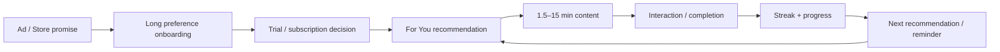
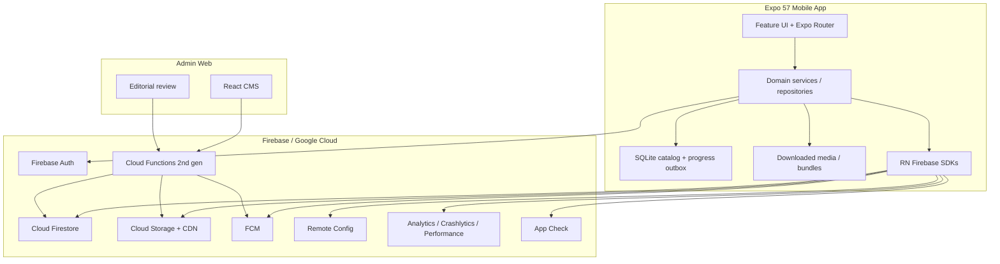
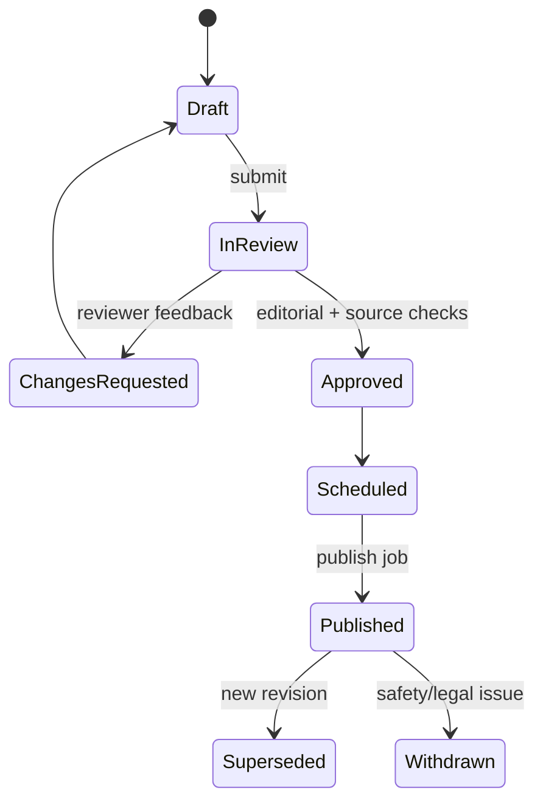
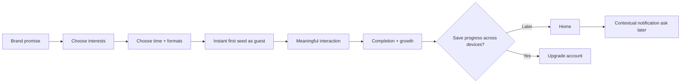

# Dananeh — Product, UX & Technical Blueprint

> نسخه 1.0 — ۲ سپتامبر ۲۰۲۶  
> وضعیت: Ready for implementation planning  
> پروژه مبنا: `/Users/erfan/Projects/Personal/wisdom-wafers`  
> مخاطب اصلی: Claude و تیم Product/Design/Engineering

---

## 0. قرارداد اجرای این سند

این سند یک specification اجرایی است، نه دستور برای بازنویسی یک‌باره‌ی پروژه. Claude Code باید هر Goal را جداگانه اجرا کند، پیش از تغییر کد baseline بگیرد، تغییرات commit‌نشده‌ی فعلی را حفظ کند و در پایان هر Goal شواهد پذیرش ارائه دهد.

قواعد الزامی:

1. ابتدا `AGENTS.md` پروژه و مستندات دقیق Expo SDK 57 خوانده شود.
2. هیچ `reset`، حذف تغییرات موجود، یا مهاجرت هم‌زمان چند لایه انجام نشود.
3. هر Goal یک PR/commit مستقل، reversible و قابل‌تست باشد.
4. schema، event و route عمومی بدون migration/versioning تغییر نکند.
5. هیچ secret، service-account key یا کلید خصوصی داخل اپ، repo یا `EXPO_PUBLIC_*` قرار نگیرد.
6. برای هر Goal: baseline → implementation → tests → screenshots/metrics → handoff note.
7. قابلیت‌های خارج از MVP پشت feature flag و خاموش به‌صورت پیش‌فرض باشند.

### Definition of Done مشترک

- TypeScript strict بدون خطا؛ lint بدون error؛ unit/integration/rules tests سبز.
- iOS، Android و web در حد scope همان Goal بررسی شوند.
- happy path، loading، empty، offline، error، permission-denied و retry state پوشش داده شوند.
- RTL فارسی، LTR انگلیسی، VoiceOver/TalkBack و text scaling بررسی شوند.
- analytics event و error context مربوط به feature تعریف و تست شود.
- مستندات، schema version و migration note همراه کد به‌روز شوند.

---

## 1. خلاصه تصمیم‌های محصول و معماری

Dananeh نباید clone فارسی Nibble باشد. هسته‌ی موفق Nibble را می‌گیرد—جلسه‌های کوتاه، تنوع فرمت، feed شخصی و عادت روزانه—اما روی چهار مزیت متمایز بنا می‌شود:

1. **Persian-native، نه ترجمه‌شده:** RTL واقعی، متن و اعداد دوطرفه‌ی درست، لحن فارسی طبیعی و محتوای بومی.
2. **Offline-first و کم‌مصرف:** هر «دانه» پس از بازشدن قابل ادامه باشد؛ بسته‌های دانلودی و progress outbox داشته باشیم.
3. **اعتماد محتوایی:** منبع، تاریخ بازبینی و امکان گزارش خطا در سطح هر دانه؛ AI منبع حقیقت نیست.
4. **یادگیری واقعی، نه فقط engagement:** active recall، مرور فاصله‌دار و feedback توضیحی؛ streak نقش حمایتی دارد، نه تنبیهی.

تصمیم‌های فنی اصلی:

| حوزه | تصمیم |
|---|---|
| Mobile | حفظ Expo 57 + React Native 0.86 + Expo Router + TypeScript |
| Firebase native | مهاجرت مرحله‌ای اپ native از Firebase JS SDK به React Native Firebase برای Auth/Firestore/Storage/Analytics/Crashlytics/Performance/Messaging/App Check |
| Web/Admin | حفظ Firebase JS SDK برای web و پنل مدیریت |
| Runtime | خروج از Expo Go و استفاده از development build/EAS؛ CNG و config plugins |
| Architecture | modular monolith با feature boundaries و repository interfaces؛ نه microservice زودهنگام |
| Content | metadata در Firestore؛ bundleهای versioned و immutable در Storage؛ draftها در CMS |
| Offline | Firestore native cache + SQLite catalog/outbox + FileSystem برای media packs |
| Search | MVP: index محلی normalized فارسی + filter؛ سپس provider پشت `SearchRepository` |
| Recommendation | ابتدا ranking قابل‌توضیح و deterministic؛ ML فقط بعد از داده و guardrail کافی |
| Backend | Cloud Functions 2nd gen برای publish، aggregation، recommendation، notification و privileged writes |
| Delivery | سه Firebase project مجزا و EAS channels جدا: dev، staging، production |

### North-star metric

**Weekly Meaningful Seeds (WMS):** تعداد دانه‌های یکتایی که کاربر در هفته تا انتها می‌رساند و حداقل یک تعامل شناختی معتبر—quiz، recall، ordering یا reflection—انجام می‌دهد.

Guardrails: D7 retention، نرخ پاسخ صحیح مرور بعد از ۷ روز، crash-free users، notification opt-out، گزارش محتوای نادرست و زمان مصرف غیرارادی. صرفاً session time یا streak نباید هدف اصلی باشد.

---

## 2. Audit واقعی skeleton موجود

### 2.1 وضعیت فعلی

- Expo `~57.0.19`، React Native `0.86.3`، React `19.2.3`، Expo Router `~57.0.18`.
- Firebase JS SDK `^12.18.0` با email/password Auth و Firestore initialization.
- NativeWind، i18next، Yekan Bakh assets و RTL اجباری.
- سه tab: Home، Explore، Profile؛ یک lesson player با text/image/quiz.
- همه‌ی catalog و lessonها local/generated هستند؛ Firestore وارد flow محصول نشده است.
- `NativeTabs` از مسیر `unstable-native-tabs` استفاده می‌شود.
- پروژه تغییرات commit‌نشده دارد؛ این تغییرات مالکیت کاربر محسوب می‌شوند و باید حفظ شوند.

### 2.2 baseline کیفیت

- `tsc --noEmit`: موفق.
- ESLint بدون cache: ۴ error و ۱۳ warning.
- error مهم runtime/code quality: فراخوانی شرطی `useColorScheme` در `src/app/lesson/[id].tsx`.
- errorهای tooling: `__dirname` در دو script با config فعلی lint.
- screenshotهای موجود همگی Auth را نشان می‌دهند؛ coverage بصری Home/Explore/Lesson هنوز قابل اتکا نیست.

### 2.3 gap map

| وضعیت موجود | ریسک | هدف |
|---|---|---|
| نام و scheme هنوز WisdomWafers | inconsistency در deep link/store/cache | rename کامل به Dananeh با migration checklist |
| Auth اجباری پیش از تجربه ارزش | افت activation | guest-first با anonymous auth و account upgrade |
| redirect با `setTimeout` | race/deep-link loss | Expo Router Protected Routes |
| Firebase JS در native | نبود Crashlytics/Analytics/App Check native | React Native Firebase + dev builds |
| mock store و `any` | coupling و خطای runtime | typed domain + repository contracts |
| یک فایل bundle generated | غیرقابل انتشار/ویرایش | CMS → immutable published bundle |
| RTL در import time و forceRTL | reload loop و layout ناپایدار | locale bootstrap پایدار و direction-aware primitives |
| NativeTabs unstable | ریسک regression و محدودیت brand | stable tabs/custom tab bar تا بلوغ NativeTabs |
| فقط ۳ card type | تجربه آموزشی محدود | block renderer قابل توسعه و schema-versioned |
| بدون rules/functions/emulators | امنیت نامشخص | deny-by-default rules + emulator tests |
| بدون test/CI/EAS | release پرریسک | quality gates و staged delivery |
| error خام Firebase در UI | افشای جزئیات و UX ضعیف | typed error mapping و localized recovery |
| فونت بدون license file | ریسک انتشار | تأیید مجوز Yekan Bakh یا جایگزین مجاز |

### 2.4 مواردی که نباید انجام شوند

- بازنویسی کل پروژه به یک framework دیگر.
- افزودن Redux، GraphQL، microservices یا AI صرفاً برای «مقیاس آینده».
- نگه‌داشتن answer correctness در payloadی که باید ضدتقلب باشد؛ برای learning casual اشکالی ندارد، اما leaderboard/reward server-authoritative باید validation سمت سرور داشته باشد.
- ذخیره‌ی هر block در یک Firestore document برای delivery نهایی؛ هزینه read و atomicity نامناسب می‌شود.
- استفاده از AsyncStorage برای token یا داده حساس.

---

## 3. Product teardown به‌روز Nibble

### 3.1 آنچه از منابع عمومی قابل مشاهده است

تا اوت ۲۰۲۶، Nibble خود را اپ general-knowledge با ۶۵۰–۶۷۰+ محتوای کوتاه در ۳۵–۳۸ موضوع معرفی می‌کند. جلسه‌ها حدود ۱٫۵ تا ۱۵ دقیقه‌اند و پنج خانواده فرمت دارد:

- interactive text lesson با quiz، animation و interaction؛
- video episode؛
- audio episode نزدیک به ۱۰ دقیقه؛
- game: Complete the Picture، Build Up، This or That، Trivia و Match the Pairs؛
- AI Tutor و گفت‌وگو با بیش از ۱۰ شخصیت تاریخی.

Information architecture اعلام‌شده شامل `For You`، `Explore`، `Play`، `AI Tutor` و `Watch` است. onboarding علاقه‌ها و نوع یادگیری را می‌گیرد؛ feed بر اساس علایق و رفتار تغییر می‌کند. تمام‌کردن یک lesson/game/video/audio یک روز streak را کامل می‌کند. Nibble در حال حاضر offline نیست.

مدل درآمد public یک subscription تمام‌دسترسی با trial هفت‌روزه است؛ قیمت بر اساس region/platform/offer متفاوت است. Store reviews در کنار رضایت از UI و interactivity، چند friction تکرارشونده نشان می‌دهند: paywall پیش از تجربه کافی، ابهام trial/renewal، کمبود عمق یا تنوع بعضی موضوع‌ها، تکرار quiz، localization ناقص و ضعف search/discoverability. این‌ها anecdotal هستند، نه آمار نماینده کل کاربران.

### 3.2 funnel و حلقه اصلی



### 3.3 چرا این مدل کار می‌کند

- **Time-boxing روشن:** کاربر قبل از شروع می‌داند commitment کوتاه است.
- **Format switching:** خواندن، دیدن، شنیدن و بازی متناسب با انرژی لحظه.
- **Card-based segmentation:** متن طولانی به واحدهای موبایلی و interaction شکسته می‌شود.
- **Immediate feedback:** quiz داخل flow است، نه امتحان جداگانه.
- **Curiosity breadth:** کاربر مجبور به یک curriculum طولانی نیست.
- **Resume/progress:** بازگشت friction کم دارد.
- **Habit cue:** streak و daily goal نقطه ورود فردا را روشن می‌کنند.

### 3.4 ضعف‌ها و فرصت Dananeh

| الگوی Nibble | برداشت برای Dananeh |
|---|---|
| تنوع زیاد فرمت | MVP را با text/image/quiz/order/match شروع کن؛ media بعد از pipeline پایدار |
| For You | recommendation قابل‌توضیح، نه feed مبهم |
| streak سخت با reset نیمه‌شب | «رشد هفتگی» + یک فرصت ترمیم؛ بدون shame copy |
| no offline | offline/resume را مزیت اصلی کن |
| subscription-first | حداقل ۳ دانه کامل پیش از هر paywall؛ قیمت و renewal شفاف |
| محتوای بسیار گسترده | launch با ۴–۶ topic عمیق و باکیفیت، نه ۳۸ topic کم‌عمق |
| AI character chat | تا وجود corpus، citation و safety layer به roadmap بعدی منتقل شود |
| weak search complaints | search فارسی از MVP؛ ad/deep link دقیقاً به promised seed برسد |
| editorial curation | workflow منبع، review و revision از روز اول |

### 3.5 اصول علمی قابل تبدیل به feature

مرور نظام‌مند ۲۰۲۴ microlearning را محتوای هدفمند، کوتاه، تعاملی و متناسب با تفاوت فرد/موقعیت/موضوع تعریف می‌کند؛ صرف کوتاه‌کردن متن کافی نیست. شواهد retrieval practice و spacing نیز از بازیابی فعال و مرور فاصله‌دار حمایت می‌کنند.

در Dananeh:

- هر دانه یک learning objective قابل‌سنجش دارد.
- هر ۲–۴ block یک micro-interaction و پایان دانه یک retrieval prompt دارد.
- پاسخ غلط توضیح و retry می‌دهد؛ فقط رنگ قرمز/سبز کافی نیست.
- review queue در روزهای ۱، ۳، ۷، ۱۴ و سپس adaptive ساخته می‌شود.
- confidence self-rating از correctness جدا ثبت می‌شود.
- interleaving بین موضوع‌های نزدیک فقط وقتی استفاده شود که discrimination را بهتر می‌کند.

---

## 4. تعریف محصول Dananeh

### 4.1 نام‌گذاری دامنه

- Product: **دانانه / Dananeh**
- واحد محتوا: **دانه**
- مسیر موضوعی: **رویش**
- مرورهای سررسید: **آبیاری**
- مجموعه ذخیره‌شده: **باغچه من**
- completion: **دانه کاشته شد** فقط در celebratory microcopy؛ در UI روزمره از واژه روشن «تمام شد» نیز استفاده شود.

استعاره رشد باید راهنما باشد، نه تزئین اجباری. از تبدیل همه iconها به برگ، خاک و گلدان پرهیز شود.

### 4.2 مخاطب و JTBD

مخاطب اولیه: فارسی‌زبان ۱۶+، کنجکاو و پرمشغله، با ۵–۱۰ دقیقه زمان پراکنده، نه الزاماً دانشجو.

> وقتی چند دقیقه زمان آزاد دارم، می‌خواهم یک مفهوم معتبر و جذاب را به فارسی یاد بگیرم و بعداً واقعاً به یاد بیاورم، بدون اینکه وارد دوره‌ای سنگین یا feed بی‌پایان شوم.

### 4.3 MVP و خارج از MVP

MVP:

- guest onboarding، interests، daily pace؛
- Home/For You، Explore، Search، Garden/Profile؛
- seed player با text، image، quote/callout، quiz، ordering و match؛
- save، download، resume، progress، review queue؛
- streak هفتگی، milestones محدود؛
- CMS با draft/review/publish و citation؛
- analytics، notifications، crash reporting، rules و CI/CD.

بعد از اثبات retention:

- audio/video production؛
- subscription/entitlements؛
- semantic recommendation؛
- AI tutor grounded و محدود؛
- social sharing/leaderboards؛
- creator marketplace.

---

## 5. معماری هدف



### 5.1 لایه‌ها

```text
src/
  app/                    # route composition only
  features/
    onboarding/
    home/
    seed-player/
    explore/
    search/
    garden/
    profile/
  domain/
    content/              # entities, schema, use-cases
    learning/
    recommendation/
    identity/
  data/
    repositories/         # interfaces + firebase/local implementations
    local/                # SQLite, outbox, migrations
    remote/               # Firestore/Functions/Storage adapters
    sync/
  design-system/
    tokens/ primitives/ patterns/
  platform/
    analytics/ notifications/ media/ app-check/
  i18n/
  test/
functions/
admin/
packages/content-schema/
```

Routes فقط screen composition و navigation را نگه می‌دارند. query، mutation، analytics و business rules داخل feature/domain قرار می‌گیرند.

### 5.2 Firebase SDK strategy

اپ native به development build منتقل شود و React Native Firebase استفاده کند؛ دلیل: Firebase JS SDK در Expo برای Auth/Firestore/Storage خوب است اما Analytics، Crashlytics و چند قابلیت native را پوشش نمی‌دهد. web و admin همچنان Firebase JS SDK دارند.

مهاجرت باید adapter-first باشد:

```ts
interface ContentRepository {
  getHomeFeed(input: FeedInput): Promise<FeedPage>;
  getSeed(id: SeedId, revision?: number): Promise<SeedBundle>;
  downloadSeed(id: SeedId): Promise<DownloadResult>;
}

interface ProgressRepository {
  get(seedId: SeedId): Promise<SeedProgress | null>;
  enqueue(event: ProgressEvent): Promise<void>;
  sync(): Promise<SyncResult>;
}
```

UI نباید هیچ import مستقیم از Firebase داشته باشد.

### 5.3 environmentها

| Environment | Firebase project | Bundle ID suffix | EAS channel | داده |
|---|---|---|---|---|
| dev | dananeh-dev | `.dev` | development | seed/mock |
| staging | dananeh-staging | `.staging` | preview | editorial QA |
| prod | dananeh-prod | none | production | production |

هیچ collection یا bucket بین staging و prod مشترک نباشد. region بر اساس کاربران واقعی و test latency انتخاب شود. اگر بازار اصلی داخل ایران است، پیش از production یک connectivity spike از ISP/device واقعی الزامی است؛ دسترسی سرویس‌های خارجی و اختلال شبکه را assumption نگیرید. repository abstraction، export روزانه و content mirror، exit strategy هستند.

---

## 6. Content model و data model

### 6.1 content hierarchy

```text
Topic → GrowthPath → Seed → SeedRevision → Blocks → Assessment → ReviewItems
```

هر SeedRevision immutable است. progress همیشه `seedId + revision` را ثبت می‌کند تا تغییر محتوا تاریخچه کاربر را خراب نکند.

### 6.2 published seed bundle

```ts
type SeedBundle = {
  schemaVersion: 1;
  seedId: string;
  revision: number;
  locale: 'fa-IR' | 'en';
  title: string;
  objective: string;
  estimatedMinutes: number;
  difficulty: 1 | 2 | 3 | 4 | 5;
  blocks: SeedBlock[];
  summary: string[];
  reviewItems: ReviewItem[];
  sources: SourceCitation[];
  accessibility: { transcript?: string; altTextComplete: boolean };
  checksum: string;
  publishedAt: string;
};
```

Blockهای MVP:

`richText`, `image`, `quote`, `callout`, `multipleChoice`, `multiSelect`, `trueFalse`, `ordering`, `matchPairs`, `reflection`, `summary`.

Block renderer باید registry-based باشد. block ناشناخته crash نمی‌دهد؛ telemetry ثبت و fallback «این بخش نیاز به نسخه جدید اپ دارد» نشان می‌دهد.

### 6.3 Firestore collections

| Path | هدف | writer |
|---|---|---|
| `topics/{topicId}` | metadata، locale availability، order | server/editor |
| `paths/{pathId}` | توالی دانه‌ها | server/editor |
| `seeds/{seedId}` | public metadata، current revision، access tier | server only |
| `seedRevisions/{revisionId}` | bundle URL/checksum/status | server only |
| `appConfig/public` | minimum version، catalog version | server only |
| `users/{uid}` | profile کمینه و preference | owner محدود/server |
| `users/{uid}/progress/{seedId}` | position، status، revision، timestamps | owner validated |
| `users/{uid}/saved/{seedId}` | bookmark | owner |
| `users/{uid}/reviews/{reviewId}` | dueAt، interval، ease، state | owner/server |
| `users/{uid}/devices/{deviceId}` | push token، platform، lastSeen | owner/server |
| `users/{uid}/daily/{date}` | daily aggregate | server only |
| `userStats/{uid}` | streak، totals، milestones | server only |
| `feeds/{uid}/items/{itemId}` | precomputed recommendations | server only |
| `reports/{reportId}` | content report | authenticated create/server manage |
| `entitlements/{uid}` | premium state | billing webhook/server only |
| `cmsDrafts/{draftId}` | editable content | editor roles |
| `cmsReviews/{reviewId}` | review/audit trail | reviewer roles |
| `publishJobs/{jobId}` | publish pipeline state | server |

### 6.4 چرا bundle در Storage است

- یک fetch/cache به‌جای چندین Firestore read برای blockها؛
- publication اتمیک و immutable؛
- checksum، compression و CDN ساده؛
- download pack و rollback به revision قبلی؛
- draft editing از delivery جدا می‌ماند.

Firestore فقط catalog قابل query را نگه می‌دارد. bundle JSON با gzip/brotli، image variants و manifest versioned در Storage منتشر می‌شود.

### 6.5 progress event

```ts
type ProgressEvent = {
  id: string;             // UUID, idempotency key
  uid: string;
  seedId: string;
  revision: number;
  type: 'started' | 'block_viewed' | 'answered' | 'completed' | 'reviewed';
  blockId?: string;
  answer?: unknown;       // بدون متن حساس/آزاد مگر ضروری
  correct?: boolean;
  occurredAtDevice: string;
  timezone: string;
  appVersion: string;
};
```

Cloud Function با event id تکرار را حذف می‌کند. completion، streak و reward نهایی server-authoritative هستند.

---

## 7. Auth، authorization و privacy

### 7.1 flow پیشنهادی

1. اپ بدون فرم ثبت‌نام باز می‌شود.
2. Firebase Anonymous Auth یک uid پایدار می‌سازد.
3. کاربر سه دانه را کامل تجربه می‌کند.
4. هنگام sync چنددستگاهی، restore یا save ارزشمند، account upgrade پیشنهاد می‌شود.
5. anonymous credential به email/password یا Apple/Google link می‌شود؛ account جدید موازی ساخته نشود.

Email verification، reset password، account deletion داخل اپ، re-auth برای عملیات حساس و errorهای localized الزامی‌اند. اگر Google Sign-In روی iOS عرضه می‌شود، Sign in with Apple نیز در scope review قرار گیرد.

### 7.2 roles

Custom claims: `admin`, `editor`, `reviewer`, `support`. claim فقط از محیط privileged تنظیم می‌شود. UI مخفی‌کردن button authorization نیست؛ rules/Functions تصمیم نهایی‌اند.

### 7.3 data minimization

- تاریخ تولد دقیق، contact list، location و advertising ID جمع نشود مگر نیاز اثبات‌شده.
- analytics بدون email/name/raw search متن حساس.
- export/delete account job تمام subcollectionها، Storage user files، push tokens و analytics identifier mapping را پوشش دهد.
- consent analytics/marketing از notification permission جدا باشد.

---

## 8. Content delivery، offline و sync

### 8.1 سه سطح cache

1. **Memory:** screen/query cache کوتاه.
2. **Persistent metadata:** Firestore native persistence + SQLite catalog.
3. **Guaranteed download:** bundle و media داخل FileSystem با manifest/checksum؛ cache سیستمی تضمین دانلود نیست.

Firestore cache برای queryهای دیده‌شده مفید است اما empty offline query می‌تواند به معنای «داده cache نشده» باشد. UX باید stale/offline badge و last updated را نشان دهد.

### 8.2 SQLite tables

```text
catalog_seed(seed_id, revision, locale, title_norm, topic_ids, manifest_json, updated_at)
download(seed_id, revision, state, bytes_total, bytes_done, checksum, path)
progress_local(seed_id, revision, block_id, state_json, updated_at)
outbox(event_id, type, payload_json, attempts, next_attempt_at)
search_token(token, seed_id, weight)
schema_meta(version)
```

`WAL` و migrationهای forward-only با backup/rollback test. برای FTS5 ابتدا `PRAGMA compile_options` روی build واقعی بررسی شود؛ اگر tokenizer مناسب فارسی نیست، normalized token table استفاده شود.

### 8.3 conflict policy

- block position: بیشترین progress معتبر در همان revision؛
- saved: last-intent-wins با tombstone؛
- quiz attempts: append-only؛
- completion: monotonic؛ completed به in-progress برنمی‌گردد؛
- preferences: server timestamp last-write-wins؛
- outbox: exponential backoff + jitter، سقف retry و dead-letter telemetry.

### 8.4 media

- image: AVIF/WebP و fallback JPEG، width variants، alt text اجباری.
- audio: AAC/MP3، transcript، duration/waveform metadata و background playback.
- video: H.264/AAC MP4 برای download؛ HLS برای streaming، با توجه به اینکه cache HLS روی iOS محدود است.
- autoplay با صدا ممنوع؛ captions و transcript الزامی؛ playback speed 0.75–2x.
- low-data mode: تصویر کم‌حجم، عدم prefetch و audio-only option.

---

## 9. Search، discovery و recommendation

### 9.1 Persian normalization

یک package مشترک برای index و query:

- Unicode NFC؛
- تبدیل `ي → ی` و `ك → ک`؛
- حذف tatweel و diacritic؛
- یکسان‌سازی فاصله/نیم‌فاصله برای matching، بدون تخریب متن نمایشی؛
- نرمال‌سازی رقم فارسی/عربی/لاتین در search key؛
- lowercase لاتین؛
- حفظ title اصلی و highlight offsets مستقل.

Mixed bidi strings، URL، عدد، فرمول و نام لاتین باید test fixture داشته باشند.

### 9.2 strategy

MVP برای catalog کوچک:

- local normalized index در SQLite؛
- topic/format/duration/difficulty filters؛
- recent searches local؛
- search analytics فقط با query category/hash یا consent مناسب.

Scale gate: وقتی catalog یا relevance نیاز را رد کرد، `SearchRepository` به یکی از این‌ها وصل شود:

1. Typesense/Algolia sync extension برای typo tolerance/faceting؛
2. Firestore Enterprise text search پس از ارزیابی هزینه و بلوغ؛
3. Firestore vector search فقط برای semantic discovery و از طریق callable backend، نه جایگزین exact Persian search.

### 9.3 explainable ranking v1

```text
score =
  0.30 interest_affinity
+ 0.18 continuation
+ 0.15 review_due
+ 0.12 format_fit
+ 0.10 difficulty_fit
+ 0.08 freshness
+ 0.07 editorial_quality
- repetition_penalty
- same_topic_saturation
```

Hard filters: locale available، published، app version compatible، age/safety، entitlement، not blocked. هر کارت دلیل ساده دارد: «چون روان‌شناسی را انتخاب کردی» یا «ادامه‌ی دانه دیروز».

Cold start از interest، زمان، format و یک seed انتخابی استفاده می‌کند. exploration حداقل ۱۵٪ feed است. بعداً contextual bandit فقط با guardrail تنوع و کیفیت editorial.

---

## 10. Learning loop، gamification و notifications

### 10.1 completion و review

- completion زمانی معتبر است که ۹۰٪ blockها دیده و interaction نهایی submit شده باشد.
- answer correctness، attempt count، response time و confidence ذخیره می‌شود.
- review scheduler: پایه ۱/۳/۷/۱۴ روز و سپس adaptive بر اساس recall.
- کاربر همیشه می‌تواند «بعداً مرور می‌کنم» بزند؛ review debt shame ایجاد نمی‌کند.

### 10.2 growth system

- daily goal: ۱ دانه یا ۵ دقیقه؛ user-configurable.
- weekly growth: ۰–۷ نقطه؛ از streak طولانی مهم‌تر.
- یک `growth grace` در هفته برای حفظ momentum.
- milestoneها محتوایی‌اند: «۵ دانه هنر + مرور موفق»، نه صرف login.
- randomness، loot box، countdown paywall و fake scarcity ممنوع.

### 10.3 notifications

permission فقط بعد از اولین completion و بعد از توضیح ارزش درخواست شود. تنظیمات:

- زمان ترجیحی و quiet hours؛
- daily seed، review due، new topic؛
- frequency cap: حداکثر یک habit notification در ۲۴ ساعت، مگر transactional؛
- deep link به seed/review دقیق؛
- local notification برای reminder شخصی، FCM برای editorial/remote؛
- token refresh، lastSeen و cleanup tokenهای stale.

Notification success فقط open rate نیست؛ completion پس از open و opt-out guardrail است.

---

## 11. Analytics، experimentation و observability

### 11.1 event taxonomy

| Event | پارامترهای ضروری |
|---|---|
| `onboarding_started` | app_version, locale |
| `onboarding_completed` | topic_count, pace, duration_ms |
| `seed_impression` | seed_id, revision, placement, rank, reason_code |
| `seed_started` | seed_id, source, online_state |
| `block_completed` | seed_id, block_type, ordinal |
| `answer_submitted` | seed_id, block_type, correct, attempt_no |
| `seed_completed` | seed_id, duration_ms, interaction_count |
| `review_completed` | item_type, correct, interval_days |
| `search_performed` | normalized_length, result_count, filter_count |
| `download_*` | seed_id, bytes, network_type, error_code |
| `notification_*` | campaign_id, type, permission_state |
| `content_reported` | seed_id, category |

Eventها schema registry، owner، description و version دارند. نام topic/search خام یا PII به analytics فرستاده نشود.

### 11.2 dashboards و SLO

- Activation: onboarding complete → first meaningful seed در ۲۴h.
- Funnel: impression → start → interaction → completion → D1 return.
- Learning: delayed-review accuracy و calibration confidence.
- Reliability: crash-free users ≥ 99.7%، ANR، cold start p75، seed load p95، sync success.
- Content: report rate، completion by revision، low-performing block.

Crashlytics custom keys: route، seed_id، revision، block_type، online_state، app_version؛ هیچ پاسخ یا متن شخصی ثبت نشود. Firebase exports به BigQuery برای analysis و data-quality jobs فعال شود.

Remote Config برای kill switch، rollout و experiment استفاده شود؛ defaultهای امن داخل binary باشند. یک experiment هم‌زمان یک فرضیه، primary metric و guardrail مشخص دارد.

---

## 12. CMS، editorial workflow و safety

### 12.1 نقش‌ها و state machine



Editor نمی‌تواند محتوای خودش را final approve کند. همه تغییرات audit log و diff دارند.

### 12.2 publish pipeline

1. validate JSON schema و locale completeness؛
2. validate unique IDs، max lengths، interaction correctness؛
3. verify citation URL، publisher، date، rights و review date؛
4. accessibility gate: alt text/transcript/caption؛
5. render preview در device widths و RTL/LTR؛
6. compile immutable bundle، compress، checksum و upload؛
7. canary metadata در staging؛
8. publish pointer transactionally؛
9. invalidate/prefetch catalog و emit `content_published`؛
10. rollback با تغییر current revision، بدون حذف artifact قبلی.

### 12.3 moderation و trust

- گزارش در سطح seed/block: factual error، harmful، bias، copyright، translation، technical.
- severity: P0 فوری withdraw، P1 review در ۲۴h، P2 backlog.
- موضوع‌های سلامت/مالی/حقوقی disclaimer و specialist review می‌خواهند.
- image/media license و attribution ذخیره شوند.
- UGC در MVP وجود ندارد.
- AI Tutor تا زمان داشتن retrieval از corpus approved، citations، prompt-injection defense، rate limit، age policy، safety classifier و human escalation خاموش است.

---

## 13. Localization، RTL و فارسی

- locale canonical: `fa-IR`؛ language و region جدا نگه داشته شوند.
- app config شامل supported locales و نام localized اپ باشد.
- direction در bootstrap تعیین و preference persist شود؛ تغییر زبان با restart کنترل‌شده، نه `forceRTL` وسط render.
- primitiveهای `Row`, `IconLabel`, `DirectionalIcon`, `BodyText` جهت را مرکزی مدیریت کنند.
- back/forward chevron و progress direction mirror شوند؛ play، check، media controls و لوگو mirror نشوند.
- اعداد آموزشی/کد/URL طبق context LTR isolate شوند؛ W3C bidi guidance رعایت شود.
- تاریخ در data ISO UTC؛ نمایش با Intl و انتخاب تقویم شمسی/میلادی در presentation.
- pluralization با ICU؛ string concatenation ممنوع.
- line-height فارسی حداقل 1.65 برای body؛ underline روی متن فارسی حداقل استفاده.
- truncation title فارسی و ZWNJ test شود.

Test matrix: iPhone کوچک/بزرگ، Android کوچک، font scale 200٪، dark/light، fa/en، mixed Persian-English-number، keyboard و screen reader.

---

## 14. Accessibility و performance budgets

### 14.1 accessibility

- WCAG 2.2 AA هدف؛ contrast متن عادی ≥ 4.5:1 و UI ≥ 3:1.
- touch target ترجیحاً 44×44 یا بزرگ‌تر.
- تمام icon buttonها label/hint/state دارند.
- quiz feedback علاوه بر رنگ، icon و متن دارد.
- focus order با ترتیب معنایی فارسی؛ modal focus trap روی web.
- Reduce Motion: رشد/celebration به fade ساده تبدیل شود.
- text scaling تا 200٪ بدون قطع CTA/answer.
- تصویر آموزشی alt text، audio transcript و video caption.
- timer quiz قابل خاموش‌کردن؛ drag interaction جایگزین tap/button دارد.

### 14.2 budgets

| Metric | target release |
|---|---|
| cold start p75 modern mid-tier | ≤ 2.5s |
| time to first usable Home cached | ≤ 1.2s |
| seed metadata p95 online | ≤ 1.5s |
| cached seed open | ≤ 300ms |
| JS dropped frames lesson transition | < 1% |
| initial bundle growth per Goal | اندازه‌گیری و justification |
| image above fold | responsive + prefetched only next item |
| crash-free users | ≥ 99.7% |

FlashList/virtualization برای catalog، memoization فقط با profiling، image dimensions از metadata، prefetch فقط next seed/block و background sync محدود.

---

## 15. Security design و Firebase Rules

### 15.1 threat model کمینه

- scraping content و premium bypass؛
- forged progress/reward؛
- IDOR روی user data؛
- editor account takeover؛
- malicious upload؛
- push abuse؛
- leaked service account؛
- callable function abuse و cost amplification.

کنترل‌ها: deny by default، Auth + App Check، least-privilege IAM، custom claims، rate limiting، budget alerts، immutable publish، validation، audit logs و secret manager.

### 15.2 Firestore rules skeleton

```firebase
rules_version = '2';
service cloud.firestore {
  match /databases/{database}/documents {
    function signedIn() { return request.auth != null; }
    function owner(uid) { return signedIn() && request.auth.uid == uid; }
    function staff(role) {
      return signedIn() && request.auth.token[role] == true;
    }

    match /topics/{id} {
      allow read: if resource.data.status == 'published';
      allow write: if false;
    }
    match /paths/{id} {
      allow read: if resource.data.status == 'published';
      allow write: if false;
    }
    match /seeds/{id} {
      allow read: if resource.data.status == 'published';
      allow write: if false;
    }
    match /seedRevisions/{id} {
      allow read: if resource.data.status == 'published';
      allow write: if false;
    }

    match /users/{uid} {
      allow read: if owner(uid);
      allow create: if owner(uid)
        && request.resource.data.keys().hasOnly([
          'displayName', 'locale', 'timezone', 'interests', 'createdAt'
        ]);
      allow update: if owner(uid)
        && request.resource.data.diff(resource.data).affectedKeys().hasOnly([
          'displayName', 'locale', 'timezone', 'interests',
          'notificationPreferences', 'updatedAt'
        ]);
      allow delete: if false;

      match /saved/{seedId} {
        allow read, create, update, delete: if owner(uid);
      }
      match /progress/{seedId} {
        allow read: if owner(uid);
        allow create, update: if owner(uid)
          && request.resource.data.seedId == seedId
          && request.resource.data.revision is int
          && request.resource.data.percent is number
          && request.resource.data.percent >= 0
          && request.resource.data.percent <= 100;
        allow delete: if false;
      }
      match /devices/{deviceId} {
        allow read, create, update, delete: if owner(uid);
      }
      match /{document=**} {
        allow read, write: if false;
      }
    }

    match /reports/{id} {
      allow create: if signedIn()
        && request.resource.data.uid == request.auth.uid;
      allow read, update: if staff('reviewer') || staff('admin');
      allow delete: if false;
    }

    match /cmsDrafts/{id} {
      allow read, write: if staff('editor') || staff('reviewer') || staff('admin');
    }
    match /{document=**} {
      allow read, write: if false;
    }
  }
}
```

این skeleton نهایی نیست. rules are not filters؛ تمام queryها باید constraints سازگار داشته باشند. privileged server SDK rules را bypass می‌کند، پس IAM و validation Functions مستقل لازم است.

### 15.3 Storage rules

- published content read طبق entitlement design؛ write فقط service account.
- user upload path با uid، size و MIME whitelist.
- executable، SVG ناشناس و arbitrary HTML ممنوع.
- upload ابتدا quarantine، سپس malware/content scan و promote.
- rules tests حداقل unauthorized، wrong-owner، malformed fields، oversized upload، editor/reviewer boundaries و query limit را پوشش دهند.

App Check ابتدا monitor، سپس staging enforce و بعد rollout درصدی production؛ debug tokens هرگز commit نشوند.

---

## 16. Testing، CI/CD و release

### 16.1 test pyramid

- Unit: normalization فارسی، scheduler، ranking، reducers/use-cases، schema validation.
- Component: هر block و state با React Native Testing Library.
- Integration: repository + SQLite + Firebase Emulator.
- Rules: `@firebase/rules-unit-testing` با allow/deny matrix.
- E2E: Maestro/Detox برای onboarding، first seed، offline resume، auth upgrade، notification deep link.
- Visual regression: light/dark، fa/en، 3 viewport، 200٪ text.
- Contract: bundle schema و backward compatibility دو app version.
- Load/cost: feed query، publish job، recommendation fanout، notification batch.

### 16.2 CI gates

On PR:

1. format/lint/typecheck؛
2. unit/component؛
3. emulator + rules؛
4. schema compatibility؛
5. Expo Doctor و dependency audit؛
6. web build و critical screenshot diff؛
7. preview build برای release-labelled PR.

On main: deploy dev، smoke test. On release tag: staging build → human QA/content signoff → store phased release.

### 16.3 EAS

- development/preview/production profiles و channel جدا.
- `runtimeVersion` هم‌راستا با binary version؛ هر native/config-plugin change binary جدید.
- EAS Update فقط برای JS/assets سازگار؛ rollout 5% → 25% → 100% با Crashlytics guard.
- store release: internal → TestFlight/closed track → phased production؛ rollback runbook ثبت شود.
- minimum supported app version با Remote Config و soft/hard upgrade policy.

---

## 17. Design system و هویت بصری

### 17.1 personality

آگاه، گرم، کنجکاو، آرام و دقیق. نه کودکانه، نه دانشگاهی خشک، نه شبیه Duolingo و نه purple-gradient clone نایبل.

### 17.2 visual concept

«دانش مثل دانه است؛ با توجه و تکرار رشد می‌کند.» بیان بصری از شکل‌های ارگانیک کوچک، حلقه‌های رشد و تغییر تدریجی استفاده می‌کند. فضای سفید زیاد، typography قوی و illustration editorial مهم‌تر از gamification پرسر‌وصداست.

### 17.3 token proposal

| Token | Light | Dark | نقش |
|---|---|---|---|
| `surface.canvas` | `#F7F4EA` | `#171A17` | کاغذ/خاک روشن |
| `surface.card` | `#FFFDF7` | `#222722` | card |
| `text.primary` | `#1F241E` | `#F4F3EB` | متن |
| `text.secondary` | `#5D665B` | `#BBC2B8` | متن ثانویه |
| `brand.primary` | `#2F6D4B` | `#77B98A` | رشد/CTA |
| `brand.sprout` | `#65A96B` | `#8BCB94` | progress |
| `accent.sun` | `#E9A928` | `#F2C45F` | curiosity/reward |
| `accent.plum` | `#6F5178` | `#B99BC2` | humanities |
| `feedback.error` | `#B5443C` | `#EF8C84` | خطا |

تمام pairها با ابزار contrast واقعی validate شوند؛ token table پیشنهاد است، نه مجوز ردکردن QA.

Typography: Yekan Bakh موجود برای فارسی، با تأیید license. body 17/30، caption 13/22، title 24–34 با optical adjustment. برای لاتین fallback سازگار انتخاب شود. spacing 4pt، touch targets 44+، radius 16/24/32 و shadow بسیار محدود.

### 17.4 motion

- 180–260ms برای transition؛ spring فقط interaction کوچک.
- completion: جوانه از progress ring بیرون می‌آید، حداکثر 700ms.
- حرکت اطلاعات را توضیح می‌دهد: انتقال block، correct answer، download progress.
- no confetti پیش‌فرض؛ reduce motion کامل.

### 17.5 content card anatomy

Topic chip → title → one-line promise → format/duration → reason → progress/download state → CTA. تصویر decorative نباید اطلاعات metadata را بپوشاند.

---

## 18. UX flows

### 18.1 First run



onboarding حداکثر ۴ step، skip‌پذیر و زیر ۶۰ ثانیه. paywall در onboarding MVP وجود ندارد.

### 18.2 Home

- greeting کم‌اهمیت؛ hero اصلی «دانه پیشنهادی امروز».
- Continue اگر unfinished وجود دارد بالاتر از recommendation.
- Review due و weekly growth در یک compact strip.
- rails محدود: برای تو، کوتاه زیر ۵ دقیقه، ادامه رویش، تازه‌ها.
- infinite feed پیش‌فرض نباشد؛ پایان روشن و CTA Explore.

### 18.3 Seed player

- header: close، title کوتاه، accessible progress، save/more.
- یک block meaningful در viewport؛ scroll یا tap بر اساس نوع، نه swipe اجباری.
- answer سپس feedback و explanation؛ CTA بعدی از feedback جدا.
- resume دقیق، offline badge، report و sources.
- exit confirmation فقط اگر state ذخیره نشده؛ در حالت عادی auto-save.

### 18.4 Completion

- summary سه نکته؛ performance بدون قضاوت؛ next review date؛ save/share؛ یک recommendation بعدی.
- celebration کوتاه و dismissible.

### 18.5 Explore/Search/Garden

- Explore: topic grid + paths + filters.
- Search: instant local results، typo/variant handling، no-result suggestions.
- Garden: In progress، Saved، Downloaded، Review due، Completed؛ استعاره رشد اینجا پررنگ‌تر است.

---

## 19. Screen، component و state inventory

### 19.1 screens

| Area | Screens |
|---|---|
| Bootstrap | Splash، migration/loading، maintenance، forced update |
| Onboarding | Welcome، interests، formats/time، first-seed handoff |
| Auth | Sign in/up، verify، forgot/reset، link anonymous، delete account |
| Home | For You، continue، daily/weekly progress |
| Explore | Topic index، topic detail، path detail، filters |
| Search | search، results، recent، no result |
| Learning | seed intro، player، sources، report، completion |
| Review | queue، review player، result |
| Garden | saved، in progress، completed، downloaded |
| Media | audio player، video player، transcript/captions |
| Profile | stats، interests، notifications، language/theme، data/privacy، subscription future |
| System | offline/download manager، errors، empty states، permission rationale |
| Admin | dashboard، editor، preview، review queue، publish job، reports، audit log |

### 19.2 component families

- Primitives: Text، Pressable، IconButton، Surface، Divider، Input، Chip، Badge، Progress.
- Navigation: AppHeader، BottomTabs، Sheet، Toast، OfflineBanner.
- Content: SeedCard، TopicCard، PathCard، ContinueCard، SourceRow.
- Blocks: RichTextBlock، ImageBlock، CalloutBlock، ChoiceBlock، OrderingBlock، MatchBlock، ReflectionBlock.
- Feedback: AnswerFeedback، ExplanationPanel، CompletionSummary، GrowthRing.
- Media: AudioMiniPlayer، AudioPlayer، VideoPlayer، TranscriptSheet، DownloadButton.
- System: Skeleton، EmptyState، ErrorState، Retry، SyncStatus، UpdateRequired.

### 19.3 state matrix اجباری

برای هر data-driven component: `idle`, `loading`, `refreshing`, `success`, `empty`, `offline-cached`, `offline-missing`, `partial`, `error-retryable`, `error-fatal`, `unauthorized`, `outdated-schema`. برای action: pressed، focused، disabled، selected، correct، incorrect، syncing، synced.

---

## 20. Roadmap اجرایی برای Claude Code

### Goal 0 — Baseline، safety و ADR

**Dependencies:** ندارد.  
**Objective:** وضعیت فعلی قابل تکرار و تغییرات کاربر محفوظ شود.

Tasks:

- snapshot `git status` و diff؛ هیچ تغییر موجود پاک نشود.
- ثبت ADRهای SDK strategy، offline، content bundle، environment.
- اصلاح ۴ lint error و baseline screenshot واقعی برای Auth/Home/Explore/Lesson.
- افزودن scripts استاندارد `typecheck`, `lint`, `test` بدون تغییر behavior.

Acceptance:

- tsc/lint error صفر؛ warningها triage شده.
- before/after screenshots و baseline report.
- هیچ فایل کاربر حذف یا reset نشده.

### Goal 1 — Rename و design foundation

**Dependencies:** G0.  
**Objective:** WisdomWafers به Dananeh بدون شکستن deep links/config مهاجرت کند.

Tasks: app name/slug/scheme/bundle IDs plan، strings، icons/splash placeholders، tokens، typography primitives، locale bootstrap. scheme قدیمی یک release به‌عنوان alias اگر app قبلاً توزیع شده؛ در غیر این صورت حذف.

Acceptance: هیچ user-facing «ویفر خرد/Wisdom Wafer»؛ fa/en visual matrix؛ contrast report؛ font license decision.

### Goal 2 — Navigation، guest auth و onboarding

**Dependencies:** G1.  
**Objective:** first value بدون login wall.

Tasks: Protected Routes، anonymous auth، upgrade/link flow، onboarding persistence، deep-link preservation، error mapping.

Acceptance: fresh install تا اولین seed ≤ 4 screen؛ offline onboarding با bundled starter seed؛ link anonymous داده را حفظ می‌کند؛ auth tests.

### Goal 3 — Domain schema و repositories

**Dependencies:** G0.  
**Objective:** جداکردن UI از mock/Firebase.

Tasks: `content-schema` با Zod/JSON Schema، typed entities، repository interfaces، mock adapter، Firestore adapter، block registry، schema compatibility tests.

Acceptance: هیچ `any` در content path؛ UI import مستقیم Firebase ندارد؛ unknown block fallback؛ fixture فارسی.

### Goal 4 — Firebase native و environments

**Dependencies:** G2,G3.  
**Objective:** production-capable native services.

Tasks: dev client/CNG، RN Firebase modules حداقلی، google-services files خارج از source secrets policy، dev/staging/prod config، Emulator wiring، App Check monitor.

Acceptance: Auth/Firestore روی device build؛ environment badge non-prod؛ prod config در dev قابل انتخاب نیست؛ smoke tests.

### Goal 5 — Offline catalog، outbox و sync

**Dependencies:** G3,G4.  
**Objective:** seed cached/downloaded بدون شبکه کامل شود.

Tasks: SQLite migrations، bundle downloader/checksum، progress outbox، conflict policy، download manager، stale UX.

Acceptance: airplane-mode resume و completion؛ reconnect دقیقاً یک event sync؛ corrupted bundle redownload؛ migration test N-1→N.

### Goal 6 — Seed player v1

**Dependencies:** G3,G5، design handoff.  
**Objective:** تجربه آموزشی production-grade.

Tasks: block types MVP، progress/resume، answer feedback، source/report، completion، accessibility و analytics.

Acceptance: تمام block fixtures fa/en؛ text scale 200٪؛ screen reader journey؛ no color-only feedback؛ completion idempotent.

### Goal 7 — Home، Explore، Search و recommendation v1

**Dependencies:** G3,G5,G6.  
**Objective:** کشف سریع و feed قابل‌توضیح.

Tasks: home rails، topic/path، Persian normalization/index، filters، ranking v1، reason codes، pagination.

Acceptance: variantهای ک/ی و نیم‌فاصله نتیجه یکسان؛ offline search؛ no-result state؛ ranking unit tests و diversity constraint.

### Goal 8 — Review، growth و notification

**Dependencies:** G6,G7.  
**Objective:** habit و retention سالم.

Tasks: review scheduler، weekly growth، grace، notification rationale/settings/deep links، token lifecycle.

Acceptance: timezone/DST tests؛ permission denied app را نمی‌شکند؛ caps/quiet hours؛ review due deterministic.

### Goal 9 — Analytics و observability

**Dependencies:** G4–G8.  
**Objective:** تصمیم‌گیری و debugging بدون PII.

Tasks: typed analytics wrapper، taxonomy، Crashlytics/Performance، BigQuery export، dashboards، Remote Config defaults/kill switches.

Acceptance: event validation CI؛ no PII audit؛ simulated crash در staging؛ funnel query و reliability dashboard.

### Goal 10 — CMS و publication

**Dependencies:** G3,G4.  
**Objective:** تولید محتوا بدون deploy اپ.

Tasks: admin scaffold، roles، editor/preview، review state، publish Function، bundle build/checksum، rollback، audit.

Acceptance: editor self-approval ممنوع؛ invalid/accessibility-incomplete publish رد؛ staging preview pixel-checked؛ rollback زیر ۵ دقیقه.

### Goal 11 — Media، accessibility و hardening

**Dependencies:** G5,G6,G10.  
**Objective:** audio/video و کیفیت release.

Tasks: audio/video player، downloads، captions/transcripts، App Check enforce rollout، rules/storage tests، performance profiling.

Acceptance: background audio controls، interrupted playback resume، low-data، WCAG AA audit، p75/p95 budgets.

### Goal 12 — CI/CD و production release

**Dependencies:** همه Goalهای release scope.  
**Objective:** staged، observable و rollbackable launch.

Tasks: CI gates، EAS profiles/channels/runtimeVersion، store metadata/privacy، backup/export، incident/rollback runbooks، phased rollout.

Acceptance: release candidate ۷ روز staging بدون P0/P1؛ restore drill؛ 5% rollout guardrails؛ ownership/on-call مشخص.

---

## 21. Migration/change plan از skeleton

### Phase A — Stabilize in place

- ساختار فعلی حفظ؛ lint hook و Auth race رفع؛ screenshot baseline.
- `src/firebase.ts` پشت adapters قرار گیرد؛ فعلاً حذف نشود.
- `generatedData` به fixture adapter تبدیل شود.
- lesson models به schema جدید map شوند؛ data فعلی migration fixture است.

### Phase B — Strangler migration

| Current | Target | روش |
|---|---|---|
| `src/data/store.ts` | `ContentRepository` | ابتدا interface، سپس mock implementation |
| `models/lesson.ts` | shared content schema | converter و compatibility test |
| `app/lesson/[id].tsx` | `features/seed-player` | screen shell باقی، logic منتقل |
| `AuthContext` redirect | protected route/session provider | behavior test سپس swap |
| `i18n.ts` forceRTL | locale bootstrap service | persisted locale + controlled reload |
| Tailwind ad-hoc colors | semantic tokens | component-by-component، نه bulk replace |
| Firebase JS native | RN Firebase adapters | service-by-service در dev build |
| local generated catalog | Firestore metadata + Storage bundle | dual-read flag، سپس remote default |

### Phase C — Dual read و cutover

- feature flag `content_source=mock|remote`.
- remote fetch با checksum و fallback mock starter seed.
- compare telemetry و QA؛ سپس remote default.
- mock fixtures برای tests باقی بمانند؛ production generated dataset حذف شود.

### Phase D — Additive monorepo

پس از پایدارشدن mobile، `functions/`, `admin/`, `packages/content-schema/` با npm workspaces افزوده شود. تغییر package manager هم‌زمان انجام نشود.

### rollback

- هر migration یک flag یا adapter قبلی دارد.
- published revision حذف نمی‌شود.
- EAS Update فقط روی runtime سازگار.
- database migration destructive نیست؛ ستون/table قدیمی حداقل یک release حفظ.

---

## 22. Prompt کامل برای Claude Design

متن زیر را مستقیم به Claude Design بدهید و در کنار آن این blueprint، screenshotهای baseline و Yekan Bakh/font license status را ضمیمه کنید.

```text
You are the lead product designer for “Dananeh / دانانه”, a Persian-first microlearning mobile app for curious adults. Produce a real, developer-ready UI/UX system—not moodboards or generic concept art.

PRODUCT
Dananeh turns 5–10 spare minutes into one credible, memorable learning unit called a “Seed / دانه”. Users explore topics, complete interactive seed lessons, actively recall ideas, review them later, and watch their knowledge grow. The brand metaphor is seed → attention → growth, but it must remain sophisticated and subtle.

AUDIENCE
Persian-speaking adults 16+, busy and curious, not necessarily students. Primary locale fa-IR and RTL. English/LTR is secondary. The experience must work on unstable/slow networks and support offline content.

POSITIONING
Persian-native, trustworthy, calm, editorial, and genuinely educational. It is not a clone of Nibble, Duolingo, Headway, Instagram, or TikTok. Avoid purple-gradient startup visuals, childish mascots, casino gamification, fake urgency, endless feeds, glassmorphism overload, and decorative plants on every screen.

BRAND PERSONALITY
Warm, intelligent, curious, precise, optimistic, grounded. Use the growth metaphor through small organic geometry, concentric growth rings, evolving progress forms, and restrained motion. White/negative space and typography should carry the design.

INITIAL COLOR DIRECTION
Canvas #F7F4EA, card #FFFDF7, ink #1F241E, secondary #5D665B, primary growth green #2F6D4B, sprout #65A96B, sun accent #E9A928, plum accent #6F5178, error #B5443C. Create dark-mode equivalents and validate WCAG 2.2 AA; adjust colors if required.

TYPOGRAPHY
Use Yekan Bakh only if the attached license permits product use; otherwise recommend a high-quality licensed Persian alternative. Prioritize Persian legibility, generous line height, correct نیم‌فاصله, Persian punctuation, mixed Persian/English/numeral bidi, and 200% Dynamic Type. Do not use text baked into images.

PLATFORMS
Expo SDK 57 / React Native 0.86, iOS and Android first, responsive web secondary. Respect native behavior where useful but keep a coherent cross-platform brand. Minimum touch target 44×44. Design for iPhone SE-sized width, modern iPhone, and small Android.

INFORMATION ARCHITECTURE
Bottom navigation: Home / خانه, Explore / کاوش, Garden / باغچه, Profile / من. Search is first-class within Explore and reachable from Home. The lesson player is a focused full-screen flow outside tabs.

CORE FLOWS TO DESIGN
1. First launch: brand promise → select interests → preferred time/formats → immediate first seed as guest → completion → optional account upgrade → contextual notification ask later.
2. Home: continue learning, today’s recommended seed, review due, weekly growth, a few finite editorial rails.
3. Explore: topics, paths, filters, search, Persian normalized results and no-result recovery.
4. Seed player: rich text, image, quote/callout, multiple choice, multi-select, true/false, ordering, match pairs, reflection, summary, sources and report.
5. Answer feedback: correct/incorrect/partial with explanation and retry; never color-only.
6. Completion: three-point summary, calm growth moment, review date, save/share and one next recommendation.
7. Garden: in progress, saved, downloaded, review due, completed.
8. Review session: due queue, active recall, confidence, results.
9. Auth upgrade: anonymous account linking, sign in/up, verification, reset, account deletion.
10. Offline/download: cached, stale, queued, downloading, corrupt/retry, storage management.
11. Profile/settings: interests, pace, notifications, language, theme, data/privacy.
12. System: loading skeleton, empty, partial data, offline missing, permission denied, retryable error, fatal error, outdated content schema, maintenance and forced update.

CONTENT CARD ANATOMY
Topic, title, one-line learning promise, format, duration, difficulty, recommendation reason, progress/download state and clear CTA. Avoid image-heavy cards that hide metadata.

SEED PLAYER PRINCIPLES
One meaningful block per viewport; clear accessible progress; autosave; precise resume; no forced swipe; close without guilt; micro-interaction every 2–4 blocks; explanation after every assessed answer; sources easy to inspect. Unknown content blocks need a safe fallback state.

GAMIFICATION
Use weekly growth and meaningful learning milestones. One grace opportunity per week. No aggressive streak reset, shame language, confetti by default, loot boxes, countdowns or manipulative paywalls.

ACCESSIBILITY
WCAG 2.2 AA, 4.5:1 normal text contrast, 3:1 UI contrast, visible focus on web, VoiceOver/TalkBack semantics, 200% text scaling, Reduce Motion, captions/transcripts, non-drag alternatives, no color-only status, and logical RTL focus/reading order.

RTL REQUIREMENTS
Design natively in RTL—not by mirroring final LTR frames. Mirror directional navigation and progress where appropriate. Do not mirror play/check/media icons or brand marks. Correctly isolate URLs, Latin names, formulas and numbers. Provide equivalent LTR examples to prove the system adapts.

DELIVERABLES
A. Product rationale and 5 design principles.
B. Complete IA and user-flow diagrams.
C. Semantic design tokens: color, type, spacing, radius, elevation, motion, icon rules, breakpoints.
D. High-fidelity light and dark designs for every core screen above, RTL first.
E. Component library with anatomy, variants, properties and interaction rules.
F. State matrix for every data-driven component: loading, refreshing, empty, cached-offline, offline-missing, partial, retryable error, fatal error, unauthorized, disabled, focused, selected, correct, incorrect, syncing and synced.
G. Interactive prototype for first-run-to-first-completion, offline resume, search-to-seed and review flow.
H. Motion specs with duration/easing and Reduce Motion alternatives.
I. Accessibility annotations, focus order, screen-reader labels and contrast results.
J. Developer handoff: exact spacing/sizing, assets, responsive behavior, localization notes, content constraints and React Native implementation notes.
K. Redlines for three screen widths and 200% text.
L. A “do not do” page showing rejected generic patterns.

QUALITY BAR
The result should feel comparable to a top-tier editorial learning product from a mature design team. Every screen must have realistic Persian copy and realistic content—not lorem ipsum. Maintain consistency across all states. Explain key tradeoffs. If a requested visual harms comprehension, RTL, accessibility or implementation, challenge it and provide a better solution.

SAMPLE PERSIAN CONTENT
Use realistic seeds such as:
- «چرا آسمان شب کاملاً تاریک است؟» — اخترشناسی — ۶ دقیقه
- «اثر لنگر چگونه تصمیم‌های مالی ما را تغییر می‌دهد؟» — روان‌شناسی — ۵ دقیقه
- «چطور یک نقاشی امپرسیونیستی را بخوانیم؟» — هنر — ۸ دقیقه
- «احتمال، واقعاً درباره‌ی چیست؟» — ریاضی — ۷ دقیقه
Use concise, natural Persian microcopy. Show sources and last-reviewed date on content details.
```

---

## 23. ریسک‌ها و decision gates

| ریسک | gate قبل از commit بزرگ |
|---|---|
| دسترسی/latency کاربران داخل ایران | test روی دستگاه و ISP واقعی؛ fallback/mirror/exit plan |
| React Native Firebase + Expo 57 compatibility | spike روی dev build برای Auth/Crashlytics/App Check قبل از migration کامل |
| NativeTabs unstable | regression matrix؛ در صورت مشکل stable/custom tabs |
| Persian search quality | corpus حداقل ۲۰۰ query و relevance benchmark |
| content production bottleneck | ۲۰ دانه end-to-end از CMS تا app قبل از افزایش topic |
| Firestore cost | read/write model و load simulation با MAU scenario |
| font licensing | مدرک license پیش از store submission |
| AI hallucination/safety | feature خاموش تا grounded evaluation و policy کامل |
| analytics privacy | event/PII audit پیش از production collection |

---

## 24. منابع و سطح اطمینان

تحقیق Nibble بر اساس صفحات رسمی، FAQ، App Store/Google Play و policyهای عمومی در ۲ سپتامبر ۲۰۲۶ انجام شده است. جزئیات implementation داخلی Nibble عمومی نیست؛ هرجا الگوریتم یا metric استنباط شده، در این سند به‌عنوان پیشنهاد Dananeh بیان شده، نه واقعیت قطعی Nibble.

### Nibble

- [Nibble FAQ: features, navigation, streak, offline, pricing](https://nibble-app.com/faq)
- [Nibble feature overview and learning formats](https://nibble-app.com/nibble-app-features)
- [Nibble interactive formats and games](https://nibble-app.com/blog/nibble-interactive-learning-format)
- [Nibble on Apple App Store](https://apps.apple.com/us/app/nibble-daily-learning-quiz/id6444046612)
- [Nibble on Google Play](https://play.google.com/store/apps/details?id=com.nibble.lesson&hl=en_US)
- [Nibble AI Usage Policy](https://nibble-app.com/policy/latest/ai.pdf)
- [Nibble Privacy Policy](https://nibble-app.com/policy/latest/privacy-policy.pdf)

### Learning science

- [Microlearning beyond boundaries: systematic review (Heliyon, 2024)](https://doi.org/10.1016/j.heliyon.2024.e41413)
- [The science of effective learning with spacing and retrieval practice (Nature Reviews Psychology, 2022)](https://doi.org/10.1038/s44159-022-00089-1)
- [Retrieval Practice Consistently Benefits Student Learning (2021)](https://doi.org/10.1007/s10648-021-09595-9)

### React Native / Expo / Firebase

- [Expo SDK 57 Notifications](https://docs.expo.dev/versions/v57.0.0/sdk/notifications/)
- [Expo SDK 57 Video and caching](https://docs.expo.dev/versions/v57.0.0/sdk/video/)
- [Expo SDK 57 Audio](https://docs.expo.dev/versions/v57.0.0/sdk/audio/)
- [Expo SDK 57 SQLite](https://docs.expo.dev/versions/v57.0.0/sdk/sqlite/)
- [Expo guide: Firebase JS SDK vs React Native Firebase](https://docs.expo.dev/guides/using-firebase/)
- [Expo Router authentication and Protected Routes](https://docs.expo.dev/router/advanced/authentication/)
- [Firestore offline persistence](https://firebase.google.com/docs/firestore/manage-data/enable-offline)
- [Firestore best practices](https://firebase.google.com/docs/firestore/best-practices)
- [Firestore security query behavior](https://firebase.google.com/docs/firestore/security/rules-query)
- [Testing Firestore rules with Emulator Suite](https://firebase.google.com/docs/firestore/security/test-rules-emulator)
- [Firebase Remote Config rollouts and experiments](https://firebase.google.com/docs/remote-config)
- [Firebase BigQuery export](https://firebase.google.com/docs/projects/bigquery-export)
- [FCM token management](https://firebase.google.com/docs/cloud-messaging/manage-tokens)
- [Firestore vector search](https://firebase.google.com/docs/firestore/vector-search)
- [Firebase full-text search options](https://firebase.google.com/docs/firestore/solutions)

### RTL و accessibility

- [W3C Arabic & Persian Layout Requirements](https://www.w3.org/TR/alreq/)
- [W3C WCAG 2.2](https://www.w3.org/TR/WCAG22/)
- [React Native Accessibility](https://reactnative.dev/docs/accessibility.html)

---

## 25. دستور شروع پیشنهادی برای Claude Code

```text
Read DANANEH_PRODUCT_TECHNICAL_BLUEPRINT.md and the repository AGENTS.md in full.
Execute Goal 0 only. Do not begin Goal 1.

Before editing:
1. Capture git status and preserve every existing uncommitted change.
2. Run the current typecheck and lint without auto-fix; record baseline.
3. Inspect current routes, Firebase initialization, RTL bootstrap and screenshots.

Then implement Goal 0 with the smallest safe diff. Do not reset, delete, or rewrite unrelated files. Do not change product behavior except to fix confirmed lint/runtime defects. Add standard scripts and ADRs, generate real baseline screenshots for Auth, Home, Explore and Lesson in Persian RTL, and provide:
- changed-file list,
- test/lint/typecheck results,
- screenshot paths,
- preserved-dirty-worktree confirmation,
- risks and exact proposal for Goal 1.

Stop after Goal 0 and wait for approval.
```

